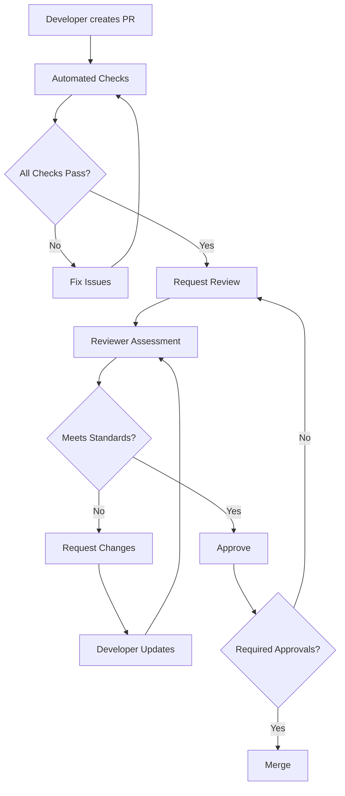

# Code Review Standards for EEG-RAG

> **Comprehensive guidelines for maintaining high code quality, consistency, and reliability in the EEG-RAG project**

## Overview

This document establishes the code review standards, processes, and quality gates for the EEG-RAG project. All code changes must pass these standards before merging.

## Table of Contents

1. [Review Process](#review-process)
2. [Code Quality Standards](#code-quality-standards)
3. [Testing Requirements](#testing-requirements)
4. [Documentation Standards](#documentation-standards)
5. [Security Guidelines](#security-guidelines)
6. [Performance Requirements](#performance-requirements)
7. [Review Checklist](#review-checklist)

---

## Review Process

### Required Reviews

| Change Type              | Reviewers Required   | Additional Requirements    |
| ------------------------ | -------------------- | -------------------------- |
| **Core Components**      | 2+ senior developers | Architecture review        |
| **Agent Implementation** | 1+ senior developer  | Integration tests          |
| **Utility Functions**    | 1+ developer         | Unit tests (>95% coverage) |
| **Documentation**        | 1+ developer         | Technical accuracy check   |
| **Bug Fixes**            | 1+ developer         | Root cause analysis        |
| **Performance Changes**  | 1+ senior developer  | Benchmark comparison       |

### Review Timeline

- **Initial Review**: Within 24 hours of PR creation
- **Re-review**: Within 12 hours after changes
- **Final Approval**: Within 48 hours for standard changes
- **Emergency Fixes**: Within 2 hours with post-review

### Review Workflow



---

## Code Quality Standards

### Python Style Guide

#### Formatting Requirements

```python
# Required: Black formatting (line length 88)
def process_eeg_query(
    query_text: str,
    max_results: int = 10,
    confidence_threshold: float = 0.8
) -> List[AgentResult]:
    """
    Process EEG research query with specified parameters.
    
    Args:
        query_text: Natural language query about EEG research
        max_results: Maximum number of results to return
        confidence_threshold: Minimum confidence score for results
        
    Returns:
        List of agent results matching the query
        
    Raises:
        ValueError: If query_text is empty or invalid
        ConnectionError: If external services are unavailable
    """
    # Implementation here
    pass
```

#### Import Organization

```python
# Standard library imports
import asyncio
import logging
from datetime import datetime
from typing import Dict, List, Optional

# Third-party imports
import numpy as np
import pandas as pd
from transformers import AutoTokenizer

# Local imports
from eeg_rag.agents.base_agent import BaseAgent, AgentQuery
from eeg_rag.utils.common_utils import validate_non_empty_string
```

### Type Hints Requirements

All functions must have complete type annotations:

```python
# ✅ Good - Complete type hints
async def search_papers(
    query: str,
    max_results: int,
    filters: Optional[Dict[str, str]] = None
) -> List[Dict[str, Any]]:
    return await api_search(query, max_results, filters or {})

# ❌ Bad - Missing type hints
async def search_papers(query, max_results, filters=None):
    return await api_search(query, max_results, filters or {})
```

### Error Handling Standards

#### Validation Requirements

```python
from eeg_rag.utils.common_utils import validate_non_empty_string, validate_positive_number

def process_query(text: str, max_results: int) -> QueryResult:
    """Process query with validation."""
    # Required: Validate all inputs
    text = validate_non_empty_string(text, "query text")
    max_results = validate_positive_number(max_results, "max_results")
    
    try:
        return _internal_process(text, max_results)
    except ExternalServiceError as e:
        # Required: Specific exception handling
        logger.error(f"External service failed: {e}")
        raise ProcessingError(f"Query processing failed: {e}") from e
    except Exception as e:
        # Required: Catch-all with context
        logger.exception(f"Unexpected error processing query: {text[:50]}")
        raise ProcessingError("Internal processing error") from e
```

#### Exception Hierarchy

```python
class EEGRAGError(Exception):
    """Base exception for EEG-RAG system."""
    pass

class ValidationError(EEGRAGError):
    """Input validation failed."""
    pass

class ProcessingError(EEGRAGError):
    """Data processing failed."""
    pass

class ExternalServiceError(EEGRAGError):
    """External service interaction failed."""
    pass
```

### Performance Requirements

#### Memory Management

```python
# ✅ Good - Explicit memory management
async def process_large_dataset(data_stream):
    """Process large dataset with memory management."""
    batch_size = 1000
    results = []
    
    async for batch in chunked_stream(data_stream, batch_size):
        batch_results = await process_batch(batch)
        results.extend(batch_results)
        
        # Required: Periodic garbage collection for large operations
        if len(results) % 10000 == 0:
            import gc
            gc.collect()
            logger.info(f"Processed {len(results)} items")
    
    return results

# ❌ Bad - No memory management
async def process_large_dataset(data_stream):
    """Process large dataset without memory management."""
    all_data = [item async for item in data_stream]  # Loads everything into memory
    return [process_item(item) for item in all_data]
```

#### Time Complexity

```python
# ✅ Good - Efficient search using indices
def find_similar_papers(query_embedding: np.ndarray) -> List[Paper]:
    """Find similar papers using FAISS index (O(log n))."""
    similarities, indices = faiss_index.search(query_embedding, k=10)
    return [papers[i] for i in indices[0]]

# ❌ Bad - Linear search through all papers
def find_similar_papers(query_embedding: np.ndarray) -> List[Paper]:
    """Find similar papers using linear search (O(n))."""
    similarities = []
    for paper in all_papers:  # O(n) operation
        sim = cosine_similarity(query_embedding, paper.embedding)
        similarities.append((sim, paper))
    return sorted(similarities, reverse=True)[:10]
```

---

## Testing Requirements

### Test Coverage Standards

| Component Type        | Minimum Coverage | Required Tests                |
| --------------------- | ---------------- | ----------------------------- |
| **Core Logic**        | 95%              | Unit + Integration            |
| **Agent Classes**     | 90%              | Unit + Boundary + Integration |
| **Utility Functions** | 95%              | Unit + Boundary               |
| **API Endpoints**     | 85%              | Integration + E2E             |
| **Error Handling**    | 100%             | Unit + Boundary               |

### Test Categories Required

#### 1. Unit Tests
```python
class TestAgentQuery:
    """Unit tests for AgentQuery validation."""
    
    def test_valid_query_creation(self):
        """Test creation of valid query."""
        query = AgentQuery(
            text="What are EEG biomarkers for epilepsy?",
            intent="research",
            context={"domain": "clinical"}
        )
        assert query.text == "What are EEG biomarkers for epilepsy?"
        assert query.intent == "research"
        assert query.context["domain"] == "clinical"
    
    def test_empty_text_validation(self):
        """Test rejection of empty query text."""
        with pytest.raises(ValueError, match="cannot be empty"):
            AgentQuery(text="", intent="research")
    
    def test_whitespace_text_validation(self):
        """Test rejection of whitespace-only text."""
        with pytest.raises(ValueError, match="cannot be empty"):
            AgentQuery(text="   \n\t   ", intent="research")
```

#### 2. Integration Tests
```python
class TestAgentIntegration:
    """Integration tests for agent coordination."""
    
    @pytest.fixture
    async def orchestrator(self):
        """Create test orchestrator with real agents."""
        return Orchestrator(
            agents=[LocalDataAgent(), WebSearchAgent()],
            memory_manager=MemoryManager()
        )
    
    async def test_multi_agent_query_processing(self, orchestrator):
        """Test coordination between multiple agents."""
        query = AgentQuery(text="EEG patterns in sleep disorders")
        
        results = await orchestrator.process_query(query)
        
        assert len(results) >= 2  # Should get results from both agents
        assert all(result.success for result in results)
        assert any("sleep" in result.data.lower() for result in results)
```

#### 3. Boundary Tests
```python
class TestBoundaryConditions:
    """Test edge cases and boundary conditions."""
    
    async def test_maximum_query_length(self):
        """Test handling of very long queries."""
        long_query = "EEG " * 1000  # 4000 characters
        query = AgentQuery(text=long_query)
        
        agent = LocalDataAgent()
        result = await agent.run(query)
        
        # Should handle gracefully without crashing
        assert result.success or "length" in result.error.lower()
    
    async def test_concurrent_agent_execution(self):
        """Test system under concurrent load."""
        agent = LocalDataAgent()
        queries = [AgentQuery(text=f"Query {i}") for i in range(50)]
        
        # Execute all queries concurrently
        results = await asyncio.gather(*[agent.run(q) for q in queries])
        
        # All should complete successfully
        assert len(results) == 50
        success_rate = sum(1 for r in results if r.success) / len(results)
        assert success_rate >= 0.95  # 95% success rate minimum
```

### Performance Tests

```python
class TestPerformance:
    """Performance benchmarking tests."""
    
    async def test_query_response_time(self):
        """Test query response time requirements."""
        agent = LocalDataAgent()
        query = AgentQuery(text="EEG alpha waves")
        
        start_time = time.time()
        result = await agent.run(query)
        elapsed = time.time() - start_time
        
        # Should complete within 2 seconds
        assert elapsed < 2.0, f"Query took {elapsed:.2f}s (limit: 2.0s)"
        assert result.success
    
    async def test_memory_efficiency(self):
        """Test memory usage during processing."""
        import psutil
        import gc
        
        process = psutil.Process()
        initial_memory = process.memory_info().rss
        
        agent = LocalDataAgent()
        for i in range(100):
            query = AgentQuery(text=f"Test query {i}")
            await agent.run(query)
            
            if i % 10 == 0:
                gc.collect()
        
        final_memory = process.memory_info().rss
        memory_increase = (final_memory - initial_memory) / (1024 * 1024)  # MB
        
        # Should not increase memory by more than 50MB
        assert memory_increase < 50, f"Memory increased by {memory_increase:.1f}MB"
```

---

## Documentation Standards

### Docstring Requirements

All classes and public methods must have comprehensive docstrings:

```python
class LocalDataAgent(BaseAgent):
    """
    Agent for searching local FAISS vector store.
    
    This agent performs semantic search over preprocessed EEG research papers
    stored in a local FAISS index. It provides fast, offline search capabilities
    for the core knowledge base.
    
    Attributes:
        vector_store: FAISS vector store for embeddings
        embedding_model: Sentence transformer for query encoding
        documents: Metadata for indexed documents
        
    Example:
        >>> agent = LocalDataAgent()
        >>> query = AgentQuery(text="EEG biomarkers for epilepsy")
        >>> result = await agent.run(query)
        >>> print(f"Found {len(result.data)} papers")
    """
    
    def __init__(
        self,
        index_path: str = "data/embeddings/faiss_index",
        model_name: str = "sentence-transformers/all-MiniLM-L6-v2"
    ):
        """
        Initialize local data agent.
        
        Args:
            index_path: Path to FAISS index file
            model_name: Name of sentence transformer model
            
        Raises:
            FileNotFoundError: If index file doesn't exist
            ModelError: If embedding model can't be loaded
        """
        super().__init__(AgentType.LOCAL_DATA, "local_data_agent")
        
    async def execute(self, query: AgentQuery) -> AgentResult:
        """
        Execute semantic search on local vector store.
        
        Performs the following steps:
        1. Encode query text using sentence transformer
        2. Search FAISS index for similar embeddings
        3. Retrieve and rank matching documents
        4. Return top results with metadata
        
        Args:
            query: Agent query with search text and parameters
            
        Returns:
            AgentResult containing:
                - success: True if search completed
                - data: List of matching papers with scores
                - metadata: Search statistics and timing
                - error: None if successful
                
        Raises:
            ValidationError: If query is invalid
            ProcessingError: If search fails
        """
        # Implementation details
        pass
```

### Code Comments

```python
# ✅ Good - Explain WHY, not WHAT
def calculate_relevance_score(query_embedding, document_embedding, metadata):
    """Calculate relevance score for document."""
    
    # Use cosine similarity as base score
    cosine_sim = np.dot(query_embedding, document_embedding) / (
        np.linalg.norm(query_embedding) * np.linalg.norm(document_embedding)
    )
    
    # Boost recent papers (papers from last 5 years get 10% boost)
    # This improves relevance for current research
    year_boost = 0.1 if metadata.get('year', 0) >= 2019 else 0.0
    
    # Apply citation count scaling (log scale to prevent dominance)
    # High-impact papers should rank higher for research queries
    citation_factor = np.log10(max(1, metadata.get('citations', 1))) / 10
    
    return cosine_sim + year_boost + citation_factor

# ❌ Bad - Comments that just repeat the code
def calculate_relevance_score(query_embedding, document_embedding, metadata):
    """Calculate relevance score for document."""
    
    # Calculate cosine similarity
    cosine_sim = np.dot(query_embedding, document_embedding) / (
        np.linalg.norm(query_embedding) * np.linalg.norm(document_embedding)
    )
    
    # Add year boost
    year_boost = 0.1 if metadata.get('year', 0) >= 2019 else 0.0
    
    # Add citation factor
    citation_factor = np.log10(max(1, metadata.get('citations', 1))) / 10
    
    # Return sum
    return cosine_sim + year_boost + citation_factor
```

---

## Security Guidelines

### Input Sanitization

```python
import re
from html import escape

def sanitize_user_input(text: str) -> str:
    """
    Sanitize user input to prevent injection attacks.
    
    Args:
        text: User-provided text input
        
    Returns:
        Sanitized text safe for processing
    """
    # Remove potentially dangerous characters
    text = re.sub(r'[<>"\']', '', text)
    
    # Limit length to prevent DoS
    if len(text) > 1000:
        text = text[:997] + "..."
    
    # Escape HTML entities
    text = escape(text)
    
    return text.strip()
```

### API Key Management

```python
# ✅ Good - Use environment variables
import os
from dotenv import load_dotenv

load_dotenv()

OPENAI_API_KEY = os.getenv("OPENAI_API_KEY")
if not OPENAI_API_KEY:
    raise ValueError("OPENAI_API_KEY environment variable required")

# ❌ Bad - Hard-coded secrets
OPENAI_API_KEY = "sk-1234567890abcdef..."  # Never do this!
```

### Data Privacy

```python
def log_query_safely(query: AgentQuery) -> None:
    """Log query without exposing sensitive information."""
    safe_query = {
        "query_id": query.query_id,
        "text_length": len(query.text),
        "has_context": bool(query.context),
        "timestamp": query.timestamp.isoformat()
    }
    
    # Never log the actual query text or context
    logger.info(f"Processing query: {safe_query}")
```

---

## Review Checklist

### Pre-Review (Author)

**Code Quality:**
- [ ] Code follows PEP 8 and Black formatting
- [ ] All functions have type hints
- [ ] Docstrings follow Google style
- [ ] No TODO comments in production code
- [ ] Import statements are organized correctly

**Functionality:**
- [ ] Code compiles without warnings
- [ ] All existing tests pass
- [ ] New features have corresponding tests
- [ ] Edge cases are handled appropriately
- [ ] Error messages are clear and actionable

**Security:**
- [ ] User input is validated and sanitized
- [ ] No secrets in code or comments
- [ ] External dependencies are secure
- [ ] No SQL injection vulnerabilities

**Performance:**
- [ ] No obvious performance regressions
- [ ] Memory usage is reasonable
- [ ] Database queries are efficient
- [ ] Large datasets are processed in chunks

### During Review (Reviewer)

**Architecture:**
- [ ] Changes align with overall system design
- [ ] New components follow established patterns
- [ ] Dependencies are appropriate and minimal
- [ ] APIs are well-designed and consistent

**Code Quality:**
- [ ] Logic is clear and well-structured
- [ ] Functions are focused and single-purpose
- [ ] Variable names are descriptive
- [ ] Code complexity is reasonable

**Testing:**
- [ ] Test coverage meets requirements
- [ ] Tests are comprehensive and realistic
- [ ] Both positive and negative cases are tested
- [ ] Integration tests cover component interactions

**Documentation:**
- [ ] Code is self-documenting
- [ ] Complex logic is well-commented
- [ ] API documentation is complete
- [ ] README updates are included if needed

### Post-Review (Author)

**Resolution:**
- [ ] All reviewer comments addressed
- [ ] Code changes re-tested after modifications
- [ ] Documentation updated for any API changes
- [ ] Performance impact assessed

**Final Checks:**
- [ ] Branch is up to date with main
- [ ] Merge conflicts resolved correctly
- [ ] CI/CD pipeline passes all checks
- [ ] Deployment considerations documented

---

## Review Standards by Change Type

### New Feature Reviews

**Additional Requirements:**
- [ ] Feature design document reviewed
- [ ] Integration with existing features considered
- [ ] Performance impact assessed
- [ ] Rollback plan documented
- [ ] User documentation updated

### Bug Fix Reviews

**Additional Requirements:**
- [ ] Root cause analysis performed
- [ ] Fix addresses root cause, not symptoms
- [ ] Regression test added
- [ ] Similar issues checked for
- [ ] Post-deployment monitoring plan

### Performance Optimization Reviews

**Additional Requirements:**
- [ ] Benchmarks before and after changes
- [ ] Memory usage impact measured
- [ ] Load testing results provided
- [ ] Potential side effects considered
- [ ] Monitoring for performance regression

### Security Fix Reviews

**Additional Requirements:**
- [ ] Security impact assessment
- [ ] Vulnerability properly addressed
- [ ] No new security issues introduced
- [ ] Security testing performed
- [ ] Documentation updated

---

## Quality Gates

### Automated Checks (Must Pass)

```yaml
# CI/CD Pipeline Requirements
quality_gates:
  code_style:
    - black --check
    - isort --check-only
    - flake8
    - mypy
    
  testing:
    - pytest tests/ --cov=eeg_rag --cov-fail-under=90
    - pytest tests/test_*_boundary_conditions.py
    - pytest tests/test_system_resilience.py
    
  security:
    - bandit -r src/
    - safety check
    - pip-audit
    
  documentation:
    - sphinx-build -W docs/ docs/_build/
    - linkcheck docs/
```

### Manual Review Gates

1. **Code Review**: 2+ approvals for core changes
2. **Architecture Review**: For major structural changes
3. **Security Review**: For authentication/authorization changes
4. **Performance Review**: For optimization or high-load features

---

## Reviewer Guidelines

### Review Focus Areas

**For Junior Reviewers:**
- Code style and formatting
- Test coverage and quality
- Documentation completeness
- Basic functionality verification

**For Senior Reviewers:**
- System design and architecture
- Performance implications
- Security considerations
- Integration complexity
- Long-term maintainability

### Review Time Expectations

- **Initial Review**: 30 minutes for small changes, 2+ hours for large features
- **Follow-up Review**: 15 minutes for addressing comments
- **Final Approval**: 10 minutes for verification

### Review Comment Guidelines

```markdown
# ✅ Good Review Comments

## Must Fix (Blocking)
**Issue**: This function doesn't validate input parameters
**Impact**: Could cause runtime errors with invalid data
**Suggestion**: Add validation using `validate_non_empty_string()`

## Suggestion (Non-blocking)
**Optimization**: Consider using a set instead of list for faster lookups
**Reason**: This loop will be O(n²) with the current implementation

## Question
**Clarification**: Why is the timeout set to 30 seconds here?
**Context**: Other similar operations use 10 seconds

# ❌ Poor Review Comments

"This looks wrong" - Not specific enough
"Fix this" - No explanation of what needs fixing
"I would do it differently" - Not constructive
```

---

## Continuous Improvement

### Review Metrics

Track and optimize:
- Average time to first review
- Review cycle time (request to approval)
- Bug escape rate (bugs found after merge)
- Code quality metrics over time

### Learning and Development

- Regular review calibration sessions
- Code review training for new team members
- Sharing best practices and common issues
- Post-incident reviews for escaped bugs

---

This document is a living standard that should be updated as the project evolves. All team members are encouraged to suggest improvements based on practical experience.

**Last Updated**: November 22, 2024  
**Next Review**: December 22, 2024